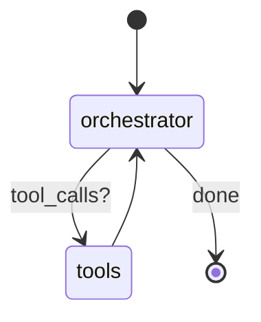
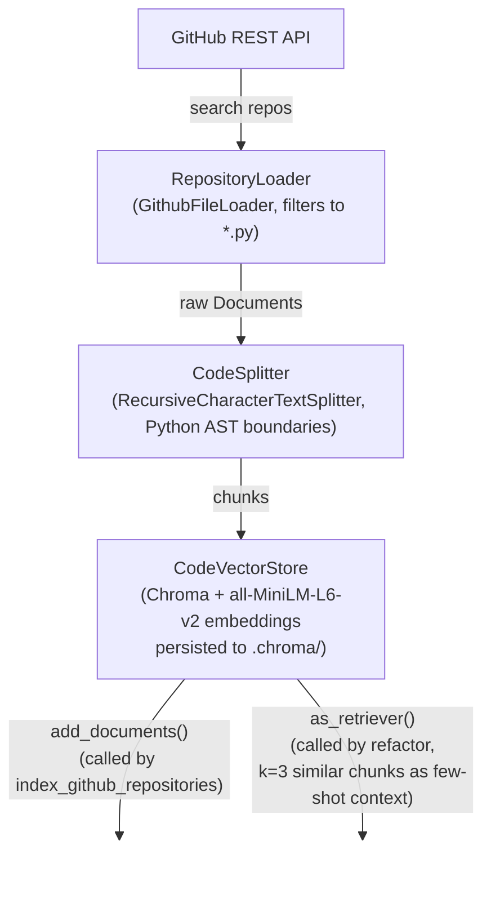

# Agentic DevTools

A terminal-based AI assistant for Python code quality. Paste code, ask it to lint, format, refactor, or run tests — the agent picks the right tool, executes it, and explains the results. Conversation history is preserved within each session.

## Features

- **Lint** — runs `ruff check` and lists every violation with rule codes and fix suggestions
- **Format** — runs `ruff format` and returns the formatted code
- **Refactor** — rewrites code for readability and PEP 8 compliance; accepts optional targeted instructions (e.g. "use dataclasses"); uses RAG to pull similar patterns from the vector store as few-shot context
- **Run tests** — executes `pytest` on self-contained test code and returns a pass/fail summary
- **Index repositories** — searches GitHub for Python repos matching a query, loads their source, and indexes it into the vector store to enrich refactoring context
- **In-session memory** — the agent remembers earlier code and results so you can chain requests ("now format it", "add a test for that")

## Requirements

- Python 3.12
- [uv](https://github.com/astral-sh/uv) (package manager)
- [Ollama](https://ollama.com/) running locally with `llama3.1` pulled

## Installation

```bash
# Clone the repo
git clone <repo-url>
cd agentic-devtools

# Install dependencies
uv sync

# Copy env template (GitHub token is only needed for the RAG loader)
cp .env.example .env
```

Pull the model if you haven't already:

```bash
ollama pull llama3.1
```

## Usage

```bash
uv run python src/main.py
```

The REPL starts with a session UUID in the banner. Enter code or instructions at the `>>>` prompt; press **Enter on a blank line** to submit. Type `quit` or press `Ctrl-C` to exit.

```
╔══════════════════════════════════════════╗
║   Agentic DevTools  —  Python Assistant  ║
║                                          ║
║  Lint, format & improve your Python code ║
║  Type 'quit' or Ctrl-C to exit           ║
║  Enter a blank line to submit your input ║
╚══════════════════════════════════════════╝

Session ID: 3f2a1b4c-...

>>> Lint this:
... def foo(x,y):
...     return x+y
...
```

### Example interactions

```
>>> Lint and format this function:
... def calculate(a,b,c):
...     return a+b+c

# agent lints, formats, explains violations

>>> Now refactor it to use keyword-only arguments

# agent remembers the code from the previous turn — no need to paste again

>>> Index 2 repos about data validation

# agent calls index_github_repositories("data validation", max_repos=2)
# fetches top-starred Python repos from GitHub, chunks and embeds their source
# → + pydantic/pydantic (22,000 stars) — 84 files, 541 chunks
# → + python-jsonschema/jsonschema (4,000 stars) — 31 files, 198 chunks

>>> Refactor my validator class using modern patterns

# agent calls refactor(), which now retrieves relevant pydantic/jsonschema
# patterns from the vector store as few-shot context
```

## Architecture

```
src/
├── main.py              # REPL — reads input, invokes agent, prints responses
└── agent/
    ├── agent.py         # LangGraph StateGraph orchestrator + MemorySaver
    └── tools.py         # lint, format_code, refactor, run_tests,
                         # index_github_repositories tool definitions
config/
    ├── config.py        # Config singleton
    └── environment.py   # .env loader (GITHUB_ACCESS_TOKEN)
models/
    └── analysis_result.py  # Structured lint output
rag/
    ├── loader.py        # GitHub repository loader (langchain-community)
    ├── code_splitter.py # AST-aware Python code chunker
    └── vector_store.py  # Chroma + HuggingFace embeddings
utils/
    └── ruff_parser.py   # Parses ruff JSON output into violation strings
```

**Agent loop** (LangGraph):



**RAG pipeline** (used by `refactor` and `index_github_repositories`):



The `orchestrator` node binds the LLM to all tools and decides what to call. The `tools` node executes the chosen tool and feeds the result back. `MemorySaver` persists the full message history keyed by `thread_id`, so each session retains context across turns without any manual history management. The vector store is a lazy singleton — the HuggingFace embedding model is only loaded on the first call to `refactor` or `index_github_repositories`.

## Configuration

| Variable | Required | Description |
|---|---|---|
| `GITHUB_ACCESS_TOKEN` | No* | GitHub token for searching and loading repositories |

*Required only if you use `index_github_repositories`. The token needs at least `public_repo` read scope.

## Development

```bash
# Install pre-commit hooks (ruff lint + format on every commit)
uv run pre-commit install

# Type-check
uv run mypy src/

# Lint
uv run ruff check src/
```
